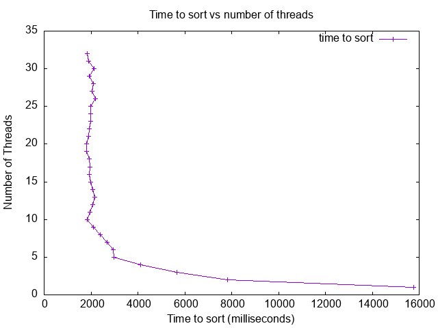

## Analysis

The graph above shows the relationship between the time taken to sort an array and the number of threads used in the multi-threaded merge sort implementation. Initially, as the number of threads increases, the time to sort decreases significantly. This is because more threads allow for concurrent execution of the sorting tasks, reducing the overall time required to process the array.

However, as the number of threads continues to increase, the graph shows a noticeable slowdown, particularly beyond 10 threads. This slowdown can be attributed to the overhead of thread management and context switching. When too many threads are created, the system spends more time scheduling and managing these threads rather than executing the actual sorting tasks. This overhead becomes substantial, especially if the number of threads exceeds the number of available CPU cores. In my case, the optimal number of threads was around 10, aligning with the number of physical cores on my machine. Beyond this point, the time taken to sort the array started to increase slightly.

The fastest performance was observed with 10 threads, where the sorting time was minimized. This result suggests that using a number of threads equal to or slightly greater than the number of physical CPU cores provides the best performance balance. On the other hand, the slowest performance was seen when using 1 thread (single-threaded execution) and when using 30 or more threads. The single-threaded execution is slower because it does not leverage parallelism, while the excessive threading introduces significant overhead, as explained earlier.

In conclusion, the results closely resemble the expected behavior based on the provided example graph. My implementation showed a clear improvement in sorting time with an increasing number of threads up to a certain point, after which the overhead caused a slowdown. This analysis highlights the importance of tuning the number of threads based on the system's capabilities to achieve optimal performance. Additionally, the experiment demonstrates the trade-off between parallel processing and thread management overhead, which is a critical consideration in multi-threaded programming.